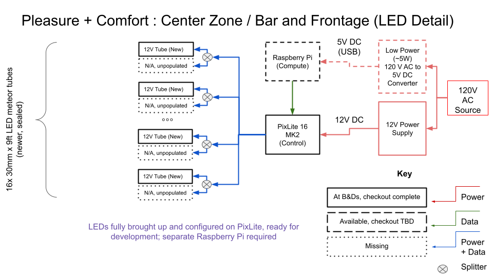
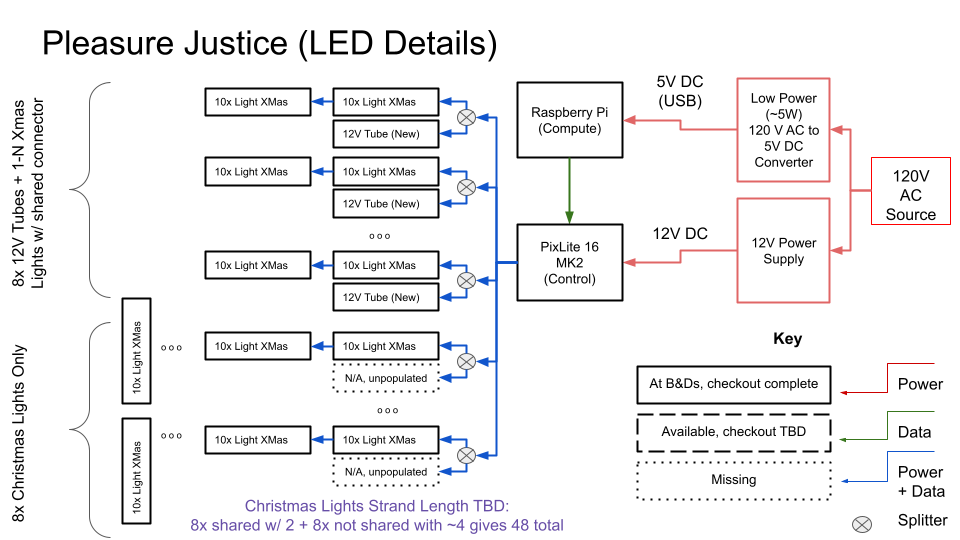
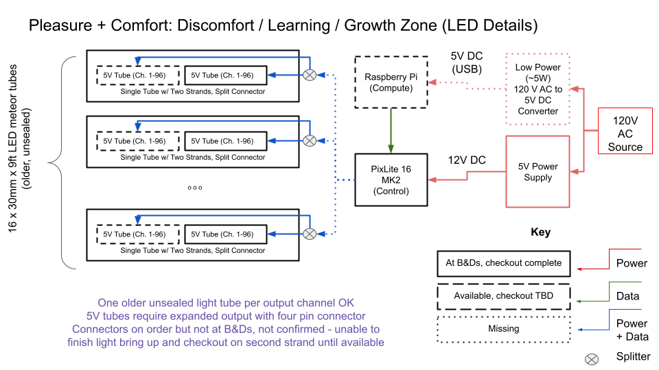

Pleasure Dairy Lighting
=======================

# Introduction

# Pleasure Dairy Lighting System Overview

The pleasure dairy lighting system consists of three areas, each with their own raspberry Pi, power source, and pixlite. Each lighting zone will be controlled separately and there will not be any data transfer between the three systems.

## Bar and Frontage Subsystem



- 16x 30mm x 9ft LED meteor tubes (newer, sealed)
    - 30mm x 9ft LED meteor tubes
        - 360 degree light (2 sides light)
        - 64 pcs SMD5050 RGB LEDs/m 
        - 32 pcs UCS2903 ICs/m
    - 12V, 138.24 W per tube? Or 43W per tube?
    - SJ-9ft-UCS2903
- 1x Raspberry Pi 
- 1x Pixlite 16 MK2
- 12V Power Supply
- 5V Raspberry Pi Power Supply


## Pleasure Justice Subsystem




- ~8x 30mm x 9ft LED meteor tubes (newer, sealed)
    - 30mm x 9ft LED meteor tubes
        - 360 degree light (2 sides light)
        - 64 pcs SMD5050 RGB LEDs/m 
        - 32 pcs UCS2903 ICs/m
    - 12V, 138.24 W per tube? Or 43W per tube?
    - SJ-9ft-UCS2903
- ~50x Incenter LED Christmas Lights
    - 12mm x 200cm LED pixel light (~70 strings of 10 LED per string)
        - 12mm LED pixel light
        - UCS1903
        - 10pcs/Chain, 
        - 20cm length between each LED
    - 12V, 3W power consumption per string
- 1x Raspberry Pi
- 1x PixLite 16 MK2
- 12V Power Supply
- 5V Raspberry Pi Power Supply

## Pleasure Comfort Subsystem



- 16x 30mm x 9ft LED meteor tubes (older, unsealed)
    - LED Rope Lights - WS2811 (or WS2813 / other) - 30LED/m
- 1 x Raspberrry Pi 4 Model B Rev 1.2
- 1 x Pixlite 16 MK2 
- 5V Power Supply

## TBD - Other subsystem components

- 5V power supply (model s 300 -5 power supply)

# Useful References

## Pixlite 16 MK II

- [Pixlite Manual](https://www.advateklights.com/downloads/user-manuals/pixlite-16-mk2)
- [Pixlite Configuration Guide](https://www.advateklights.com/downloads/user-manuals/pixlite-configuration-guide)
- [Supported Pixel protocols](https://www.advateklights.com/knowledge-base/pixel-protocols)

## Raspberry Pi 4 Model B Rev 1.2

- [Raspberry Pi 4 Model B Rev 1.2 Specs](https://www.raspberrypi.com/products/raspberry-pi-4-model-b/specifications/)
- [General Raspberry Pi User Guide](https://www.cs.unca.edu/~bruce/Fall14/360/RPiUsersGuide.pdf)
- [General Raspberry Pi Documentation](https://www.raspberrypi.com/documentation/)
- [Raspberry Pi Display 1.1 Documentation](https://www.raspberrypi.com/documentation/accessories/display.html)

## LED Programming

- [Overview of WS2813 Lights and Control](https://www.sdiplight.com/what-is-ws2813-led-and-how-to-use-ws2813/)
- [UCS1903 Overview and Electrical Background](https://cdn.sparkfun.com/assets/6/d/6/c/3/UCS1903_IC-manul.pdf)
- [UCS2903 Pixel Protocol Overview](https://www.advateklights.com/knowledge-base/ucs2903)
    - RGBW version is [UCS2904](https://www.advateklights.com/knowledge-base/ucs2904)

## Power Supplies

- [5V Power Supply Purchase Link](https://www.sunsky-online.com/p/S-RSP-0111A/S-300-5-DC-0-5V-60A-Regulated-Switching-Power-Supply-100~240V-.htm)
- [General Switching Power Supply Manual from Meanwelll](https://www.power-supplies.com.au/files/mean-well-user-technical-manual.pdf)
- [12V Power Supply Datasheet](https://www.meanwell.com/productPdf.aspx?i=469#1)
- [12V Power Supply Purchase Link](https://www.mouser.com/ProductDetail/MEAN-WELL/SE-600-12?qs=%252B6mEGs9UJHwj0bmY3T4KsQ%3D%3D&gclid=Cj0KCQjwwvilBhCFARIsADvYi7LZ1YHaaP-1CW_h0xP9RxNGU6WAKvi664m51BgY7NbI-mHp1WlqSWQaArVWEALw_wcB)

# Setup

## Raspberry Pi 

### Initial Setup

1. Download the Raspberry Pi Imager to create the SD card with the Raspberry Pi OS.  The Raspberry Pi Imager can be downloaded from [here](https://www.raspberrypi.com/software/).
2. Gather required supplies for installation; you'll need a USB mouse, USB keyboard, display, cables to hook up the display (the Pleasure Dairy Raspberry Pi comes with an attached display) if running the Raspberry Pi with a U.I. If running headless, these are not required.
3. Run the Raspberry Pi Imager and select the right operating system for install
    - For older (model 1/2) raspberry Pis, select a 32 bit operating system
    - Newer versions can use a 64 bit
    - Raspberry Pi OS Lite (64 bit), the headless version of the operating system, was selected for the Pleasure Dairy devices
4. Select the SD card to install the operating system on
5. Click settings and set a hostname for the device (write this down), toggle enable SSH, and set a username and password for the device
6. Set the WIFI SSID, name, password, and country for the device
7. Write the image to the card
8. Install the microSD card onto the raspberry pi and power on the device
9. Follow directions [here](https://www.tomshardware.com/reviews/raspberry-pi-headless-setup-how-to,6028.html) to set up access over wifi or ethernet

### Raspberry Pi VNC Setup

To setup a VNC connection for a headless system, additional instructions are needed beyond those provided in the link above.

1. First, install / upgrade the VNC server on the Raspberry Pi.  This can be done by running the following command on the Raspberry Pi:
    ```
    sudp apt update
    sudo apt install realvnc-vnc-server realvnc-vnc-viewer
    ``` 
2. Follow these [instructions](https://m.clearbluedesign.com/make-headless-raspberry-pi-vnc-open-in-1080p-9f644ecc3cdd) to force a screen resolution for headless VNC.
2. Next, set the VNC resolution via terminal using the following process.
    - Enter "sudo raspi-config" in the terminal
    - Select "Display Resolution"
    - Select "VNC Resolution" and choose a resolution
    - Reboot the device
3. Unfortunately, VNC viewer does not work with a console only boot so you'll need to change the boot settings to boot to the desktop
    - Install lxsession using "sudo apt-get install lxsession" to enable the desktop environment
    - Enter "sudo raspi-config" in the terminal
    - Select "System Settings" and then "Boot / Auto Login" and change Autologin to "Desktop Autologin"
    - Reboot the device
4. Verify that the VNC server is set up correctly by following the local connection over wifi instructions below
5. To enable a remote connection over the internet, a RealVNC account is required; the RealVNC lite account option is free for non-commercial use and limited to 1 user, 3 devices
6. After an account is made, run "vnclicensewiz" on the Raspberry Pi to provide login information via a graphical interface

References: [Setup guide for headless (no monitor)](https://www.tomshardware.com/reviews/raspberry-pi-headless-setup-how-to,6028.html) and [Setup guide for normal operation (with monitor)](https://www.raspberrypi.com/documentation/computers/getting-started.html)

## Pixlite 16 MK2

## Setting Up the PixLite Board (initial configuration)

1. Connect the PixLite to a 12V or 5V power supply (depending on the voltage of the lights that will need to be controlled)
2. Connect the power supply to a wall outlet to power on the PixLite
3. Connect an ethernet cable from the PixLite to a OSX device, Windows device, or network where it can be accessed by the host device (note: can't be a linux computer or the Raspberry Pi for the MK2) you're using to initially configure the PixLite
4. Find the IP address for the device
    - For OSX, this can be done using the "ifconfig" command in terminal or by going to system preferences -> network -> USB10/100 LAN and reading the IP address
5. Ping the device to verify the connection is working
    - For OSX, the command is "ping <ip address>" in terminal


### Configuration with Avatek Asistant 

1. Download the Avatek Assistant SW for the MK1/2 models from [here](https://www.advateklights.com/downloads/advatek-assistant)
    - Avatek does not appear to offer a linux version of the Avatek Assistant 2 so you'll need to use an osx or windows computer
    - The Avatek Assistant 3 is available for linux but does not appear support the MK1/2 models (it's paired with MK3).
2. Open the Avatek Assistant and look for your PixLite device; if it's not showing up, try selecting a different adapter and hitting search
3. Click on the pixlite device you want to configure (can refer to the PixLite configuration guide above for more details)
    - On my host computer, I received a warning that the IP address settings on the deivce were not compatible with the host computer; hitting yes on this popup window gives IP address settings that can be used to connect to the device

#### IP address settings / Network configuration steps

Note: the IP address settings for the host computer / network adapters / raspberry Pis are important to get right.  If the IP address settings are not compatible, the PixLite device will not be able to be found by the Raspberry Pi, even if it can be controlled by the Advatek Assistant. This [file](https://docs.google.com/spreadsheets/d/1xNqIdJ2WjTZfyuVhxgLQYUdHf0_oKs64MjlumyWdJEw/edit?usp=sharing) contains a description of the network adapter settings and pixlite IP address settings by device.  The following steps can be used to set up the network adapter settings on a host computer and the PixLite device.

4. Update the IP settings on the host computer to enable compatibility with PixLite
    - To modify these settings on a Mac:
        - open System Preferences -> Network -> USB10/100 LAN -> Advanced -> TCP/IP
        - Select manual for the configure IPv4 option and manually enter an ip address and subnet mask
        - My settings for the first USB ethernet adapter were:
            - Ip address: 192.168.0.20
            - Subnet mask: 255.255.255.0
    - For background on what this is doing, learn about ip addresses / subnet masks [here](https://avinetworks.com/glossary/subnet-mask/) and PixLite requirements [here](https://www.advateklights.com/knowledge-base/advatek-assistant-v2-troubleshooting)
5. Update the IP settings on the PixLite device to match the host computer adapter using the popup window in step 3
    - If the PixLite is connected directly to a computer or network switch without a router, the static option must be used
    - The PixLite subnet mask must match the subnet mask of the host computer adapter
    - The IP address must be within the address range of the host computer adapter; in this example, my host adapter mask is 255.255.0.0; this means that the first two numbers of the IP address must match the host computer adapter IP address and the last two numbers can be anything from 0 to 255 (they can't match the host computer exactly)
    - To match with this, I selected a PixLite IP address of:
        - IP Address: 192.168.0.40
        - Mask: 255.255.255.0
    - Verify the connection by pinging the device again
6. Refresh the network adapters in Advatek Assistant and select the correct network adapter; hit search to find the pixlite
7. Select the pixlite and hit configure; this time, the pop up should open with additional settings for control, LEDs, test, and Misc
8. First, update the firmware; the latest Mk2 firmware can be found [here](https://www.advateklights.com/downloads/firmware/pixlite-mk2)
8. Set up the pixlite with the right settings - all three pixlites for each subsystem have been configured with these settings:
    - [Pixlite Settings](https://docs.google.com/spreadsheets/d/1xNqIdJ2WjTZfyuVhxgLQYUdHf0_oKs64MjlumyWdJEw/edit#gid=0)
    - If any issues are found with these and changes are required, they will need to be reconfigured with the Advatek Assistant tool on a windows or osx computer; if this is done, please update the settings in that document
9. Test the light connections using the testconfiguration tab

### Connecting PixLite to Raspberry Pi

1. Log onto the Raspberry Pi and find the IP address for the eth0 adapter using ipconfig; if an IP address is not assigned to eth0, it will need to be configured
2. Connect the PixLite to the Raspberry Pi using an ethernet cable and power on
    - If a usb network adapter is configured with a static IP address in the above steps on another computer, it can be transfered to the raspberry Pi and then used to connect to the PixLite without changing Raspberry Pi network settings
3. Run ifconfig on the raspberry pi to confim the IP address
4. Ping the PixLite to confirm the connection is working

## LX Studio

### Setting up LX Studio Dependencies on Raspberry Pi

To run LX Studio applications on Raspberry Pi, Java must first be installed. To install the Temurin 17 JDK used for LX studio, this can be done by executing:

```
sudo apt-get install temurin-17-jdk
```

Eclipse will also need to be installed to run the LX Studio IDE via the following steps:
1. Install a browser using "sudo apt-get install chromium-browser"
2. Go to the Eclipse download page and download the latest release
3. Extract the installer using "tar xvzf eclipse-inst-jre-linux-aarch64.tar.gz"
4. Run the installer using "./eclipse-inst"

### Configuring Raspberry Pi network settings for LX Studio
TODO - https://github.com/heronarts/LXStudio/wiki/Raspberry-Pi


### Installing LX Studio Libraries

Navigate to the working directory for eclipse; for Pleasure Dairy development, this was put in the repo for Pleasure-Dairy at pleasure_dairy/bin and either add them as a submodule or clone the following repositories.

1. To add as submodule:
    - Note: When cloning the pleasure dairy repo on a new machine, to pull in these submodules use "git submodule update --init --recursive"
```
git submodule add https://github.com/heronarts/P4LX.git bin/P4LX
git submodule add https://github.com/heronarts/LX.git bin/LX
```
2. To clone:
```
git clone https://github.com/heronarts/LP4LX.git
git clone https://github.com/heronarts/LX.git 
```

Note: LXStudio-IDE must be intalled separately on each platform. It is configured in a platform specific way upon opening and running the code and cannot be synced via the git repo. To install, follow the instructions above or [here](https://github.com/heronarts/LXStudio-IDE.git)


## Network Configuration

To use the newer Amazon USB drivers, install driver for the USB adapter [here](https://www.asix.com.tw/en/product/USBEthernet/Super-Speed_USB_Ethernet/AX88179)

The network configuration instructions are included above and in this [document](https://docs.google.com/spreadsheets/d/1xNqIdJ2WjTZfyuVhxgLQYUdHf0_oKs64MjlumyWdJEw/edit#gid=0).


## Light Configuration

The pleasure dairy lighting systems contain three separate light types; the file below has 1-2 of each light, broken out by subsystem, configured to match the pixlite control settings.

    pleasure_dairy/pd_all_test_setup.lxp

This can be used as an example for new LX Studio designs. Additionally, the following files are the final intent templates for the LX Studio lights. These files should be properly set up to control the entiriety of the light system for each subsystem. They currently only contain a simple color cycle function but they can be added to and modified as needed to create other lighting effects.

1. TODO - create Pleasure Justice template
2. pleasure_dairy/pdpl2_pleasure_comfort_LED_layout.lxp
3. TODO - create Bar and Frotage template

If additional files are needed, make a copy of these - they contain the right network protocol, IP address, channel numbers, lengths, positions, and other settings to match the pixlite configuration and pleasure dairy system.

## Deployment in the final setup

TODO - determine how to deploy the LX Studio applications on the Raspberry Pi on load in a headless configuration, without manual intervention

TODO - determine how to integrate buttons and other features into the system

# Developing for Pleasure Dairy

## Connect to Raspberry Pi

### Local connection (ssh)

Use the login information in the .env file (procured directly from @jcm-art) to connect to the Raspberry Pi over SSH. This can be done by plugging into the network adapter directly or connecting to the same unmanaged ethernet switch as the Raspberry Pi and requires being physically present.

### Local connection to GUI (VNC)

1. Download and install [VNC Viewer](https://www.realvnc.com/en/connect/download/viewer/macos/) for your non-Raspberry Pi device
2. Run the VNC Viewer and select "run without account"
5. If connecting over Wifi on a local network:
    - Enter the hostname for the Raspberry Pi (this is the hostname you set in the Raspberry Pi Imager)
    - Enter the username and password for the Raspberry Pi 

### Remote connection to GUI (VNC)

1. Download and install [VNC Viewer](https://www.realvnc.com/en/connect/download/viewer/macos/) for your non-Raspberry Pi device
2. Run the VNC Viewer and sign into your RealVNC account
    - You will need to sign in to the Pleasure Dairy RealVNC account on your computer to connect to the device; this account is limited to one user and 3 devices total (login information is in the .env file, obtained directly from @jcm-art)
3. If connecting over the internet:
    - Navigate to the "Pleasure Dairy" team in VNC Viewer and select the name of the raspberry pi device you want to connect to 

### Remote connection to Console (VNC)

TODO - add instructions on remote connection via console only

## Configure Raspberry Pi

### Setting up the Raspberry Pi Webcam

To use the webcam attached to the raspberry pi for remote development, install cheese by running the following command in terminal:
```
sudo apt-get install cheese

```

After the installation is complete, open cheese by entering "cheese" in terminal.

### Set the screen brightness

First, install a text editor for terminal of your choice (for VIM, use "sudo apt-get vim"). Then edit the brightness file of the attached display (display name will be in the backlight file, for the RPi screen attached to pleasure-dairy-1 this is "10-0045") by running the following command in terminal:
```
sudo vim /sys/class/backlight/10-0045/brightness 
```
This will reduce nuisance and power for remote development without impacting the VNC settings.


